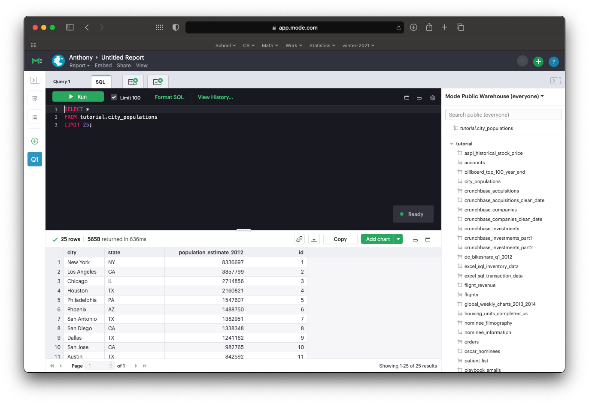

# Mode.com Sign Up Walkthrough

The first workshop in the SQL workshop series to get Data Science students
familiar with SQL syntax and basic queries.

## Resources Needed

- Free mode.com account (Gives access to 40+ datasets to query on)
- Accessible email to sign up

## Sign Up and Open a New 'Report'

1. Head over to mode.com.

2. Click 'Sign Up' or 'Try for free'.

3. Enter email.

4. Recieve email verification.

5. Enter: name, username, password.

6. Create a new report. Press the green + in top right of screen. 

7. A new code editor window should appear with the datasets down the right side bar. 

8. Test a query

```SQL
SELECT *
FROM tutorial.city_populations
LIMIT 25;
```
